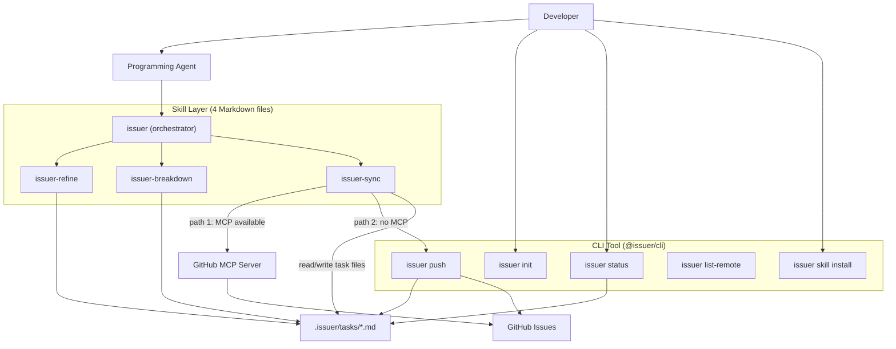

# Issuer v2 — Skill + CLI Architecture Design

**Date**: 2026-05-06
**Status**: Approved, ready for implementation planning
**Supersedes**: All prior v1 designs (SQLite + AI Engine + stdio adapter)

---

## 1. Background & Motivation

The original v1 bundled too many concerns into one process: it owned AI enhancement, local persistence (SQLite), a stdio sub-process adapter protocol, and platform API calls. This led to:

- Heavy runtime dependencies (OpenAI SDK, better-sqlite3, child_process)
- Duplicated AI capability — every programming agent already has one
- Per-project credential management that duplicated whatever the user's agent already has configured for MCP servers

**v2 decouples the product into two layers**:

| Layer | Form | Responsibility | AI? | Network? |
|---|---|---|---|---|
| **Part 1 — Skills** | Markdown instructions | Constrain programming agents on how to turn colloquial requirements into structured tasks | ❌ (agent's own) | ❌ |
| **Part 2 — CLI** | TypeScript Node.js tool | Read task files → push to platform → write back IDs | ❌ | ✅ (only push step) |

The sync step prefers the user's already-configured platform **MCP server** (e.g. GitHub MCP), falling back to the CLI only when no MCP is available.

---

## 2. Architecture Overview



**Key principles**:

1. **Skill layer has no code, no network**. It only teaches the programming agent what to do.
2. **CLI layer never runs AI**. It parses Markdown, calls APIs, writes back state.
3. **Sync is dual-channel**: MCP-first (zero config), CLI fallback (works without an agent).

---

## 3. Project Identifiers

| Item | Value |
|---|---|
| GitHub repository | `issuer` |
| npm scope | `@issuer` |
| Primary package | `@issuer/cli` |
| Global CLI binary | `issuer` |
| Future brand domain | `issuer.dev` |
| Local project directory | `.issuer/` |

---

## 4. Skill Design

### 4.1 Four Skills

| Skill | Role | Input | Output |
|---|---|---|---|
| `issuer-refine` | Clarify & complete text into a structured PM brief | **Quick**: `/issuer-refine <text>` (text arg, no confirmation)<br>**Interactive**: user supplies source scope (selection / paragraph / file) and output mode (`replace` / `new-file`) | Refined brief; `new-file` mode writes `.issuer/briefs/<slug>.md` and appends an entry to `.issuer/index.md` |
| `issuer-breakdown` | Split a brief into work items | **Quick**: `/issuer-breakdown <text-or-path>` (path → read brief; raw text → delegate to `issuer-refine` first, then breakdown)<br>**Interactive**: brief path OR raw text (same delegation rule) | One or more `.issuer/tasks/YYYY-MM-DD-<slug>.md` files (status `draft`); tasks appended under the brief entry in `.issuer/index.md` |
| `issuer-sync` | Push to platform (MCP-first, CLI fallback) | `.issuer/tasks/` files with `status: ready` | Issues created/updated on platform; frontmatter rewritten with `platform_id`, `platform_url`, `status: synced` |
| `issuer` | Orchestrator for the three stages | **Quick**: `/issuer <text>` passes text straight into Stage 1<br>**Interactive**: user's raw request | Stage 1 → Stage 2 → Stage 3 with pause-and-confirm between stages |

### 4.2 Orchestrator Flow

```
Stage 1 (issuer-refine):
  → Quick: use argument text directly
  → Interactive: confirm scope + output mode
  → Agent rewrites for clarity
  → Writes .issuer/briefs/<slug>.md and updates .issuer/index.md (new-file mode)
  → ⏸ pause & confirm

Stage 2 (issuer-breakdown):
  → Requires a brief file at .issuer/briefs/<slug>.md;
    if missing, delegate to issuer-refine first.
  → Break down into multiple task files under .issuer/tasks/
  → Each file: YAML frontmatter + Markdown body
  → Appends task entries under the brief in .issuer/index.md
  → ⏸ pause & confirm (user flips selected files to status: ready)

Stage 3 (issuer-sync):
  → Detect a matching MCP server (GitHub, GitLab, Jira, …)
  → If available → push via MCP, write back frontmatter
  → Else → invoke `issuer push` CLI
  → ⏸ done
```

### 4.3 Sync Skill Detection Logic

The `issuer-sync` skill (natural-language directive to the agent):

1. Read `mcp_capabilities` from `.issuer/config.yml` (populated by `issuer init`).
2. **If `channel: mcp`** and the required capability exists → use MCP tools directly. Map frontmatter fields to MCP tool parameters. On success, update the frontmatter (`platform_id`, `platform_url`, `status: synced`, `updated_at`).
3. **If a required capability is missing** (e.g. `update: false`) → fall back to CLI for that operation. Never silently skip the gap; always inform the user which operation used which channel.
4. **If `channel: cli` or `mcp_capabilities` is absent** → check whether the `issuer` CLI is installed. If yes, run `issuer push` for each ready file. If neither, instruct the user to install `@issuer/cli` or configure a platform MCP server.

### 4.3.1 MCP Capability Probe (`issuer init`)

**Problem**: Each platform MCP exposes a different set of tools. Some (e.g. Yunxiao MCP) lack update / comment capabilities. Issuer needs to know the exact capability surface *before* sync attempts.

**Solution**: Combine two sources — a **built-in adapter registry** (static baseline) and **live probing** (runtime detection):

1. **Built-in adapter registry** — ships with `@issuer/cli`, declares the known baseline per platform. The table below lists the tool names that map to each of Issuer's five capability groups (`create`, `update`, `search`, `read`, `comment`). Tools not relevant to Issuer sync are omitted for brevity.

#### GitHub (`github/github-mcp-server`)

The official GitHub MCP Server exposes 49 tools across 5 active toolsets (as of 2025-10). The **Issues** toolset (13 tools) fully covers Issuer sync needs:

| Capability | Tool | Key Parameters |
|---|---|---|
| `create` | `create_issue` | `owner`, `repo`, `title`, `body`, `assignees`, `labels`, `type` |
| `update` | `update_issue` | `owner`, `repo`, `issue_number`, `title`, `body`, `state`, `state_reason`, `assignees`, `labels` |
| `search` | `search_issues` / `list_issues` | `query`, `owner`, `repo`, `sort`, `order`, `page`, `perPage` / `owner`, `repo`, `state`, `labels`, `since` |
| `read` | `get_issue` | `owner`, `repo`, `issue_number` |
| `comment` | `add_issue_comment` | `owner`, `repo`, `issue_number`, `body` |

Additional relevant tools (not mapped to core capabilities but useful for Issuer):

| Tool | Purpose | Issuer relevance |
|---|---|---|
| `add_sub_issue` / `remove_sub_issue` / `list_sub_issues` | Sub-issue management | Mapping `epic` → parent issue with sub-issues |
| `assign_copilot_to_issue` | Assign Copilot to auto-resolve | Future: auto-assign after sync |
| `list_issue_types` | Get organization issue types | Type mapping during init |
| `get_label` / `list_label` | Label management | Label dedup / auto-label |

#### Yunxiao (`alibabacloud-devops-mcp-server`)

| Capability | Tool | Key Parameters |
|---|---|---|
| `create` | `create_work_item` | `spaceIdentifierId`, `subject`, `description`, `workItemTypeIdentifier`, `priority`, `assignedTo` |
| `update` | ✗ | Not available — CLI fallback required |
| `search` | `search_workitems` | `spaceIdentifierId`, `subject`, `status`, `page`, `perPage` |
| `read` | `get_work_item` | `spaceIdentifierId`, `identifier` |
| `comment` | ✗ | Not available — CLI fallback required |

Additional relevant tools:

| Tool | Purpose | Issuer relevance |
|---|---|---|
| `get_work_item_types` | Get project work item type list | Type mapping during init |
| `search_projects` / `get_project` | Project lookup | `spaceIdentifierId` discovery during init |
| `get_current_organization_Info` | Organization info | `organizationId` discovery during init |

#### Capability summary comparison

| Capability | GitHub MCP | Yunxiao MCP |
|---|---|---|
| `create` | ✓ `create_issue` | ✓ `create_work_item` |
| `update` | ✓ `update_issue` | ✗ (CLI fallback) |
| `search` | ✓ `search_issues` / `list_issues` | ✓ `search_workitems` |
| `read` | ✓ `get_issue` | ✓ `get_work_item` |
| `comment` | ✓ `add_issue_comment` | ✗ (CLI fallback) |
| Sub-item support | ✓ `add_sub_issue` / `remove_sub_issue` / `list_sub_issues` | ✗ |
| Type discovery | ✓ `list_issue_types` | ✓ `get_work_item_types` |
| Label management | ✓ `get_label` / `list_label` | ✗ (no label concept) |

#### GitLab (`gitlab-org/gitlab` remote MCP server)

GitLab's official MCP server is built into the GitLab instance (GitLab 18.6+, Beta). It uses OAuth 2.0 and supports HTTP transport. The tool set is growing but currently limited for Issuer sync:

| Capability | Tool | Key Parameters |
|---|---|---|
| `create` | `create_issue` | `id` (project path/ID), `title`, `description`, `labels`, `assignee_ids`, `milestone_id`, `epic_id` |
| `update` | ✗ | Not available yet — CLI fallback required |
| `search` | `search` (scope=`issues`) | `scope`, `search`, `project_id`, `state`, `fields` |
| `read` | `get_issue` | `id` (project), `issue_iid` |
| `comment` | `create_workitem_note` | `body`, `project_id`/`url`, `work_item_iid` |

Additional relevant tools:

| Tool | Purpose | Issuer relevance |
|---|---|---|
| `create_merge_request` | Create MRs | Future: auto-create MR after sync |
| `get_merge_request` | Read MR details | Future: MR status tracking |
| `search` (scope=`projects`) | Project lookup | Project ID discovery during init |
| `get_workitem_notes` | Read comments on work items | Read existing comments |
| `manage_pipeline` | CI/CD pipeline operations | Future: pipeline integration |

#### Capability summary comparison (3 platforms)

| Capability | GitHub MCP | GitLab MCP | Yunxiao MCP | Yunxiao OpenAPI (CLI fallback) |
|---|---|---|---|---|
| `create` | ✓ `create_issue` | ✓ `create_issue` | ✓ `create_work_item` | ✓ `CreateWorkitem` |
| `update` | ✓ `update_issue` | ✗ (CLI fallback) | ✗ (CLI fallback) | ✓ `UpdateWorkItem` |
| `search` | ✓ `search_issues` | ✓ `search` | ✓ `search_workitems` | ✓ `ListWorkitems` |
| `read` | ✓ `get_issue` | ✓ `get_issue` | ✓ `get_work_item` | ✓ `GetWorkitem` |
| `comment` | ✓ `add_issue_comment` | ✓ `create_workitem_note` | ✗ (CLI fallback) | ✓ `CreateWorkitemComment` |
| Sub-item support | ✓ | ✗ | ✗ | ✗ |
| Type discovery | ✓ | ✗ | ✓ | ✓ |
| Label management | ✓ | ✓ (via create_issue) | ✗ | ✗ |

> **Key insight**: Yunxiao MCP only covers create/search/read (3/5), but the OpenAPI covers all 5 capabilities. The CLI adapter (`src/adapter/yunxiao/`) uses the OpenAPI directly with `Bearer <PAT>` auth against `openapi-rdc.aliyuncs.com`, closing the MCP capability gap entirely. This means `issuer push` for yunxiao can operate at full capability via CLI even when MCP lacks update and comment.

2. **Live probing** — during `issuer init`, the CLI calls the MCP server's `list_tools` endpoint and compares the returned tool list against the five capability groups. The result overrides the registry baseline and is written to `.issuer/config.yml`:

```yaml
mcp_capabilities:
  channel: mcp          # or cli (if user opts out or no MCP found)
  probed_at: 2026-05-07T14:32:05Z
  tools:                 # actual tool names returned by this MCP server
    - create_work_item
    - search_workitems
    - get_work_item
    - get_work_item_types
  capabilities:          # derived from tools → capability mapping
    create: true
    update: false
    search: true
    read: true
    comment: false
```

3. **Capability gap handling**:

| Scenario | Behavior |
|---|---|
| MCP has `create` but no `update` | First push → MCP; subsequent pushes → CLI fallback for update only; inform user |
| MCP has neither `create` nor `update` | Entire sync falls back to CLI; user informed at init |
| MCP not available at all | `channel: cli` in config; no probing needed |
| Platform not in registry | Probe only (no baseline); result still written |

4. **User communication** — `issuer init` prints a summary:

```
Platform: yunxiao (MCP: alibabacloud-devops-mcp-server)
Capabilities: create ✓ | update ✗ | search ✓ | read ✓ | comment ✗

⚠ update not available via MCP — `issuer push` (CLI) will handle updates.
```

5. **Re-probing** — `issuer init` can be re-run at any time. If the MCP server was upgraded, the new capabilities overwrite the old ones.

### 4.4 Language Policy

- **Skill markdown files** are authored in English. Programming agents have stronger instruction-following on English skill definitions, and English files are universally portable across agent platforms.
- **Runtime outputs** (chat responses, refined brief body, task file `title` and body, file-name `<slug>`, table reports) MUST match the user's interaction language. Switch only when the user explicitly asks for another language.
- **Slug rules** allow non-Latin characters (e.g. Chinese / Japanese) — keep original glyphs instead of transliterating; only strip characters illegal on common filesystems.

### 4.5 Outline Index (`.issuer/index.md`)

A project-wide three-level outline jointly maintained by `issuer-refine` and `issuer-breakdown`:

```markdown
# Issuer Index

<!-- Auto-maintained by issuer-refine and issuer-breakdown. Structure: Topic → Brief → Tasks. -->

## <Topic / module>

- **<Brief title>** — [briefs/<slug>.md](briefs/<slug>.md)
  - [ ] <Task title> — [tasks/<id>.md](tasks/<id>.md)  <!-- status: draft -->
  - [x] <Task title> — [tasks/<id>.md](tasks/<id>.md)  <!-- status: synced, <platform_url> -->
```

Rules:

- `issuer-refine` appends a new brief entry when it writes a new brief file (new-file mode). Topic heading is inferred; when uncertain between two similar topics, the skill asks the user once.
- `issuer-breakdown` appends task bullets under the matching brief entry; if the entry does not exist yet, it adds one (the brief file is guaranteed to exist by Preconditions).
- Upkeep is strictly **append-only** — skills never remove or rewrite existing topics, briefs, or task lines.

---

## 5. Task File Format

### 5.1 Directory Structure

```
<project-root>/
  .issuer/
    config.yml                              # Platform config
    index.md                                # Outline index (Topic → Brief → Tasks)
    briefs/
      账户登录体验优化.md                       # Refined briefs (slug in user's language)
      login-timeout.md
    tasks/
      2026-05-06-login-timeout.md
      2026-05-06-export-excel.md
```

Flat layout inside each subdirectory (no nested folders). Task filename: `YYYY-MM-DD-<slug>.md`. Brief filename: `<slug>.md`.

### 5.2 File Format — YAML Frontmatter + Markdown Body

```markdown
---
id: login-timeout
type: bug
title: Login timeout has no user-facing message
status: draft
platform: github
platform_id: null
platform_url: null
priority: high
labels: [auth, ux]
created_at: 2026-05-06T10:00:00Z
updated_at: 2026-05-06T10:00:00Z
---

## Description

Users hit a timeout when logging in and the page shows nothing.

## Reproduction Steps

1. Open the login page
2. Enter credentials
3. Wait 30 seconds

## Acceptance Criteria

- [ ] Show a friendly message on timeout
- [ ] Provide a retry button

## Original Input

> Users complained that login keeps timing out with no feedback.
```

### 5.3 Frontmatter Schema

| Field | Type | Required | Values |
|---|---|---|---|
| `id` | string | ✅ | slug, kebab-case |
| `type` | enum | ✅ | `bug` \| `story` \| `task` \| `epic` |
| `title` | string | ✅ | — |
| `status` | enum | ✅ | `draft` \| `ready` \| `synced` |
| `platform` | string | ✅ | `github` (MVP only) |
| `platform_id` | string \| null | ✅ | null until synced |
| `platform_url` | string \| null | ✅ | null until synced |
| `priority` | enum | ✅ | `critical` \| `high` \| `medium` \| `low` |
| `labels` | string[] | ✅ | free-form |
| `created_at` | ISO8601 | ✅ | Full timestamp with wall-clock time (e.g. `2026-05-06T14:32:05Z`); never collapse to `T00:00:00Z` |
| `updated_at` | ISO8601 | ✅ | Full timestamp; equals `created_at` on first write, advances on every edit |

**Explicitly excluded from MVP** (to keep scope small):

- `content_hash` — git already tracks versions
- `sync_state` — collapsed into `status`
- `parent` (epic→story hierarchy)
- `assignees`, `milestone`

**Markdown body sections** (by convention, referenced by `issuer-breakdown` skill):

- `## Description`
- `## Reproduction Steps` (bug only)
- `## Acceptance Criteria`
- `## Original Input`

---

## 6. CLI Commands

```bash
issuer init                              # Initialize .issuer/config.yml + .issuer/tasks/
issuer push [file...]                    # Push ready tasks (or specific files)
issuer status                            # Stats: counts by draft/ready/synced
issuer list-remote                       # Read-only snapshot of GitHub issues
issuer skill install [--path <dir>]      # Install skill files to agent skills directory
```

### 6.1 `issuer init`

**Interactive**:

```text
$ issuer init

? Select target platform:
  ❯ GitHub
    Jira (coming soon)
    Linear (coming soon)

? GitHub owner (org or user): your-org
? GitHub repo: your-repo

✓ Created .issuer/config.yml
✓ Created .issuer/tasks/
```

**Non-interactive**:

```bash
issuer init --platform github --owner your-org --repo your-repo
```

### 6.2 `issuer push`

1. Scan `.issuer/tasks/` for files with `status: ready` (or use the provided file paths).
2. Parse frontmatter and Markdown body.
3. If `platform_id` is null → call GitHub `POST /repos/{owner}/{repo}/issues` (create).
4. Else → call GitHub `PATCH /repos/{owner}/{repo}/issues/{number}` (update).
5. Write back `status: synced`, `platform_id`, `platform_url`, `updated_at` to the frontmatter.

### 6.3 `issuer status`

Walks `.issuer/tasks/`, counts files by status, prints a summary table.

### 6.4 `issuer list-remote`

Fetches open issues from the configured GitHub repo and prints them read-only. Does not mutate local files.

### 6.5 `issuer skill install`

Auto-detects common agent skills directories (e.g. `~/.agents/skills/`, `~/.claude/skills/`, `~/.qoder/skills/`). The user may override with `--path`. Copies the four skill directories from the CLI's bundled `skills/` folder.

---

## 7. Configuration

### 7.1 `.issuer/config.yml`

```yaml
version: 1
platform: github
github:
  owner: your-org
  repo: your-repo
```

### 7.2 Credentials (CLI push path only; MCP path needs no credentials)

Resolution order:

1. Environment variable `ISSUER_GITHUB_TOKEN`
2. Environment variable `GITHUB_TOKEN`
3. File `~/.issuer/credentials.yml`:

```yaml
github:
  token: ghp_xxx
```

---

## 8. Technology Stack

| Purpose | Choice |
|---|---|
| Language | TypeScript |
| Runtime | Node.js 20+ |
| CLI framework | Commander.js |
| Interactive prompts | @inquirer/prompts |
| Frontmatter parsing | gray-matter |
| GitHub API | @octokit/rest |
| Testing | Vitest |
| Build | tsup (ESM + CJS dual output) |

**Removed (vs v1)**: `better-sqlite3`, `openai`, `child_process` stdio IPC.

---

## 9. Project Layout

```
issuer/
  package.json
  tsconfig.json
  vitest.config.ts
  tsup.config.ts
  .gitignore
  README.md

  src/
    index.ts                      # CLI entry
    core/
      types.ts                    # TaskFile interface, enums
      errors.ts                   # IssuerError subclasses
      task-file.ts                # frontmatter + body parse/serialize
      task-store.ts               # scan .issuer/tasks/ directory
    adapter/
      types.ts                    # Adapter interface
      github/
        client.ts                 # Octokit wrapper
        mapper.ts                 # TaskFile ↔ GitHub issue
        index.ts                  # GitHub adapter impl
    config/
      loader.ts                   # config.yml + credential resolution
    cli/
      parser.ts                   # Commander routes
      output.ts                   # formatting helpers
      commands/
        init.ts
        push.ts
        status.ts
        list-remote.ts
        skill-install.ts

  skills/                         # Bundled with CLI, copied by `issuer skill install`
    issuer/SKILL.md
    issuer-refine/SKILL.md
    issuer-breakdown/SKILL.md
    issuer-sync/SKILL.md

  tests/
    unit/
      core/
      adapter/
      cli/
    fixtures/
      tasks/
```

---

## 10. MVP Scope Boundaries

| ✅ In | ❌ Out |
|---|---|
| GitHub Issues (create + update) | Jira / Linear / 云效 |
| Dual sync: MCP-first + CLI fallback | Bidirectional sync / pull |
| `list-remote` read-only | Auto-merge of remote changes |
| Flat task list | Epic→Story hierarchy |
| Four skills (refine/breakdown/sync/orchestrator) | Skill marketplace |
| English-only CLI output | i18n (Chinese/English switch) |
| Env var + plain-text credentials | OAuth / encrypted credentials |
| `issuer skill install` local copy | Online skill registry |

---

## 11. Known Risks

1. **Plain-text credentials** are acceptable for MVP but must be documented. Users should rely on MCP path (zero credential) whenever possible.
2. **MCP tool availability detection** happens inside the agent (natural-language check). Misdetection falls back to CLI, so failures are recoverable.
3. **Concurrent edits** (multiple agents or humans touching the same task file) are not handled. v1 content-hash conflict detection is intentionally dropped; rely on git as the version-control source of truth.

---

## 12. Open Questions (deferred to post-MVP)

- Bidirectional sync (pull from platform) — needed for team collaboration
- Encrypted credential store (keytar / OS keychain)
- Additional platform adapters (Jira, Linear, 云效)
- Task hierarchy (epic → story → task → bug)
- Online skill distribution

---

## 13. Approval

This design was agreed upon across the brainstorming dialogue. Implementation planning begins next.

**Decided in the dialogue**:

- Directory-style task storage (option D)
- YAML frontmatter + Markdown body (option B)
- Four skills: three atomic + one orchestrator
- Fixed path `.issuer/tasks/`, flat, `YYYY-MM-DD-<slug>.md`
- Frontmatter minimum set (with my recommendations accepted)
- CLI push-only option D; env-var credentials; GitHub only for MVP
- npm scope `@issuer`
- Bin name `issuer`; local directory `.issuer/`
- Skill distribution option D (bundled in CLI + `issuer skill install`)
- Fresh rebuild, including `.git`
- MCP-first sync with CLI fallback; MVP implements both
- `issuer init` confirms platform interactively
- English-only CLI output; English-only skill markdown
