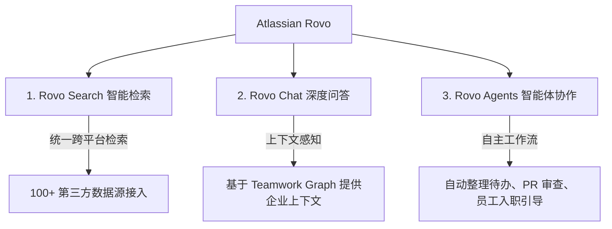
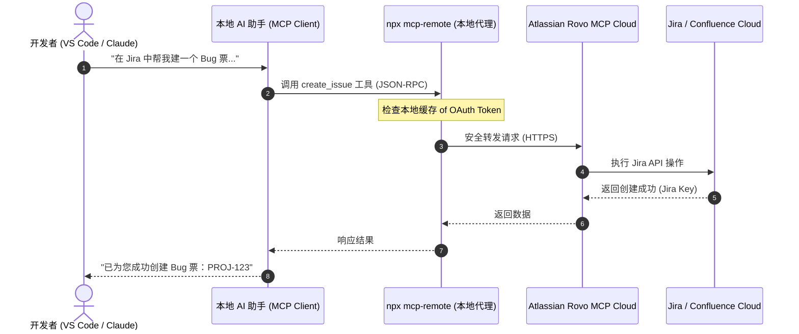

# Atlassian Rovo & Rovo MCP Server: 深度调研与技术指南

本报告针对 **Atlassian Rovo** 以及官方 **Rovo MCP (Model Context Protocol) Server** 进行了深入调研，系统性解析了其核心架构、工作原理、安全机制、客户端配置方法以及在项目集成中的潜在应用价值。

---

## 1. 什么是 Atlassian Rovo？

**Atlassian Rovo** 是 Atlassian 推出的一款由 AI 驱动的新型协作产品，旨在帮助团队在海量的组织知识中进行**“查找 (Find)”**、**“学习 (Learn)”**和**“行动 (Act)”**。它不仅深度整合了 Atlassian 自身的产品生态（如 Jira、Confluence、Compass 等），还可以无缝连接第三方企业应用（如 Slack、Google Drive、GitHub、Figma 等），为企业打造一体化的智能知识引擎。

### 1.1 核心功能支柱



1. **Rovo Search (查找)**
   * **多源聚合**：突破工具孤岛，支持一键在 Atlassian 工具链及 Google Drive、Slack、GitHub 等 100 多个第三方工具中跨源并发搜索。
   * **语义理解**：利用自然语言理解能力，提供比传统关键字匹配更精准的意图检索。
   * **权限对齐**：完全尊重既有的企业用户安全权限，用户仅能检索到其被授权访问的内容。

2. **Rovo Chat (学习)**
   * **情境级会话**：内置于 Jira、Confluence 页面或通过浏览器插件使用。
   * **智能合成**：能根据企业内的碎片信息直接提炼出项目状态更新、系统中断分析或会议纪要。
   * **智能推荐**：在对话中自动推荐专家、相关文档 and 进行中的关联项目。

3. **Rovo Agents (行动)**
   * **虚拟队员 (Virtual Teammates)**：支持预设或自定义的 AI 智能体，拥有自主行动和调用工具的能力。
   * **流程自动化**：可以协助清理积压的 Jira 任务（Grooming Backlog）、根据模板生成 Confluence 页面、审查代码 PR 是否符合验收标准等。
   * **可定制性**：支持通过无代码界面快速创建，或基于 Atlassian Forge 进行高阶开发。

---

## 2. Rovo 的核心技术架构

Rovo 并非简单的 LLM 套壳，其核心竞争力在于 Atlassian 的底层技术栈：

* **Teamwork Graph (团队协作图谱)**
  Rovo 的“中枢神经系统”。它是一个关系数据模型，能够实时描绘企业内部**人 (People)**、**项目 (Projects)**、**任务 (Issues/Jira)**、**代码 (Code)** 和 **文档 (Confluence)** 之间的关联。这使得 AI 能够拥有极强的“企业上下文感知”，避免生成脱离实际的虚假信息。
* **多模型融合策略 (Multi-Model Approach)**
  Atlassian 内部采用混合 LLM 架构，根据任务类型的不同（如简单的文本提炼 vs 复杂的推理行动），动态分发给最合适的底层模型，从而在成本、速度和准确度之间达到最佳平衡。
* **严格的权限隔离 (Permission-Aware & Security)**
  在召回阶段（Retrieval Phase），Rovo 会强制进行权限过滤，确保敏感信息（如人力资源文档、核心技术机密）不会泄露给无授权用户。

---

## 3. Rovo MCP Server 深度解析

**Model Context Protocol (MCP)** 是由 Anthropic 提出的一项开源标准，用于让 AI 客户端（如 Claude Desktop、Cursor、VS Code 等）安全、规范地连接外部数据源与工具。

Atlassian 官方紧跟这一趋势，推出了官方的 **Atlassian Rovo MCP Server** (`atlassian/atlassian-mcp-server`)。它是一个**安全的云端桥接代理**，将 Atlassian Cloud 的数据与工具暴露给兼容 MCP 的本地 AI 助手。



### 3.1 核心设计特点

1. **混合云端与本地代理模式 (Remote-Local Proxy)**
   * **云端侧**：Atlassian 在其云端托管了实际的 MCP 解析器（`https://mcp.atlassian.com`），直接对接 Jira/Confluence 的内部 API。
   * **本地侧**：开发者无需配置繁琐的 API 凭证或在本地拉起庞大的数据库，只需通过本地运行一个轻量级的 Node.js 代理客户端 `mcp-remote`，负责本地 IDE 到 Atlassian 云端的安全长连接。
2. **极简的安全授权机制 (Just-in-Time Auth)**
   * **OAuth 2.1 认证 (推荐)**：首次运行时，本地代理会唤起浏览器，引导用户进行 OAuth 2.1 三方授权 (3LO)。授权通过后，Token 缓存在本地目录中。AI 助手的每一个动作都直接绑定该用户的实际 Atlassian 账号权限。
   * **API Token 认证 (高级)**：对于 CI/CD 或无人值守脚本等 Headless 环境，企业管理员可以在 `admin.atlassian.com` 中开启 API Token 模式，用作服务账号。
3. **强大的工具集覆盖 (Actionable Tools)**
   * **搜索工具**：利用 Rovo Search 语义检索 Jira 票据、Confluence 文章以及第三方接入数据。
   * **写操作工具**：创建、更新、评论 Jira 任务，创建和编辑 Confluence 页面，关联 Compass 组件等。

### 3.2 💡 重要端点升级与迁移

> [!IMPORTANT]
> Atlassian 对其 Rovo MCP Server 的连接端点进行了重大升级：
> * **旧端点**：`https://mcp.atlassian.com/v1/sse` （**将于 2026 年 6 月 30 日彻底废弃**）。
> * **新端点**：**`https://mcp.atlassian.com/v1/mcp`** 或 **`https://mcp.atlassian.com/v1/mcp/authv2`**。
> * **升级建议**：所有新配置必须使用新端点，若已有旧配置需尽快完成迁移，以防认证失效。

---

## 4. 客户端配置指南 (Claude Desktop / Cursor)

要在本地的 AI 助手（如 Claude Desktop 或 Cursor）中集成 Atlassian Rovo MCP Server，请按照以下步骤操作：

### 4.1 环境准备
* 确保本地安装了 **Node.js (v18+)**。
* 拥有 Atlassian Cloud 账号（Jira 或 Confluence 使用权）。

### 4.2 步骤一：完成首次 OAuth 浏览器授权
在终端中执行以下命令。该命令会利用 `npx` 下载并运行 `mcp-remote` 代理，并指向 Atlassian 官方的 MCP 服务端点：

```bash
npx -y mcp-remote https://mcp.atlassian.com/v1/mcp
```

* **终端输出**：会提示正在等待授权，并自动唤起默认浏览器。
* **浏览器操作**：登录您的 Atlassian Cloud 账号，选择要授权的站点（Site），并点击 "Accept"。
* **授权完成**：终端会显示授权成功，并将凭证安全地缓存到本地目录 `~/.mcp-auth/` (Windows 系统通常在 `C:\Users\<Username>\.mcp-auth\`)。此时可以在终端中按 `Ctrl+C` 退出该临时命令。

### 4.3 步骤二：修改客户端配置文件

#### A. Claude Desktop 配置
打开 Claude Desktop 的配置文件（路径通常为 `%APPDATA%\Claude\claude_desktop_config.json`），在 `mcpServers` 节点中加入以下配置：

```json
{
  "mcpServers": {
    "atlassian-rovo": {
      "command": "npx",
      "args": [
        "-y",
        "mcp-remote",
        "https://mcp.atlassian.com/v1/mcp"
      ]
    }
  }
}
```

> [!TIP]
> **多租户/多站点 (Multi-site) 支持：**
> 如果您在企业中需要跨多个 Atlassian 站点工作，可以通过 `--resource` 参数进行隔离，或使用特定语法指定站点：
> ```json
> "args": [
>   "-y",
>   "mcp-remote",
>   "https://mcp.atlassian.com/v1/mcp",
>   "--resource",
>   "https://your-company.atlassian.net/"
> ]
> ```

#### B. Cursor IDE 配置
1. 打开 Cursor 选项，进入 **Settings > Features > MCP**。
2. 点击 **+ Add New MCP Server**。
3. 填入以下参数：
   * **Name**: `atlassian-rovo`
   * **Type**: `command`
   * **Command**: `npx -y mcp-remote https://mcp.atlassian.com/v1/mcp`
4. 点击 **Save**。

---

## 5. Rovo MCP 对 `@issuer/cli` 项目的集成启示

在 `@issuer/cli` (一款支持本地与多平台同步的敏捷任务/工单管理 CLI 工具) 中，Atlassian Rovo MCP 提供了极具吸引力的集成路线：

### 5.1 方案对比：原生 API 适配器 vs MCP 智能路由

| 维度 | 方案 A：开发原生 `JiraAdapter` (API v2/v3) | 方案 B：桥接 Rovo MCP 智能代理 (Zero-Code) |
| :--- | :--- | :--- |
| **开发工作量** | **高**：需要编写账户凭证校验、Markdown 转 ADF、多层级类型动态获取缓存、故障重试等。 | **极低**：通过 `mcp-detect` 自动检测并借用本地 MCP 客户端已有的工具链（如 `create_issue`）。 |
| **认证管理** | 需要处理 Basic Auth (API Token) 存储，且需要用户手动配置密匙。 | 无需管理密匙，直接继承本地 IDE/Claude 已经完成的 OAuth 2.1 安全凭证。 |
| **富文本处理** | 必须在本地处理 Markdown 与 Atlassian Document Format (ADF) JSON 格式之间的复杂双向转换。 | Rovo MCP 会自动接收 Markdown 或自然语言，并由云端大模型与代理自动完成 ADF 适配。 |
| **功能延展性** | 仅限于 Jira 工单的增删改查。 | **无限可能**：不仅可操作 Jira，还可一键检索 Confluence 的背景设计文档或 Compass 架构图。 |

### 5.2 推荐的双轨制落地策略

1. **核心骨干：原生 `JiraAdapter` (基础同步保障)**
   * 在 `src/adapter/jira/index.ts` 中实现基础的 `Adapter` 接口，使用 `fetch` 直接调用 Jira REST API (v2)。
   * 支持用户在没有 MCP 环境的裸命令行（如 CI/CD 流水线）中使用 `issuer push` 进行精准同步。
2. **高阶体验：MCP 桥接器 (智能双写)**
   * 在 CLI 中加入 `mcp-detect.ts`，检测当前环境是否存在 Atlassian Rovo MCP。
   * 当用户在支持 MCP 的 IDE (如 Cursor) 中开发时，智能路由会将同步请求自动委托给 Rovo MCP Server 的 `create_issue` 工具，实现无需任何本地配置 (Zero-Config) 的零代码 Jira 适配器。
